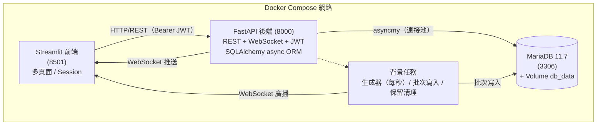
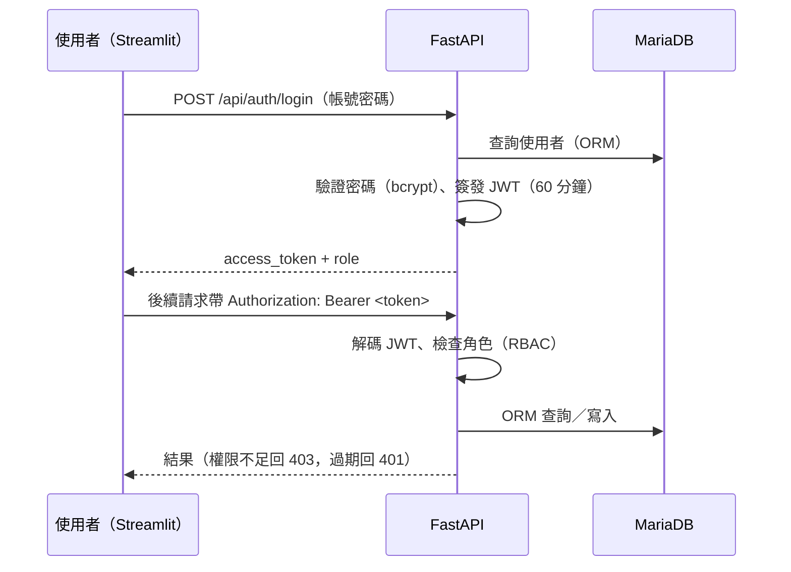
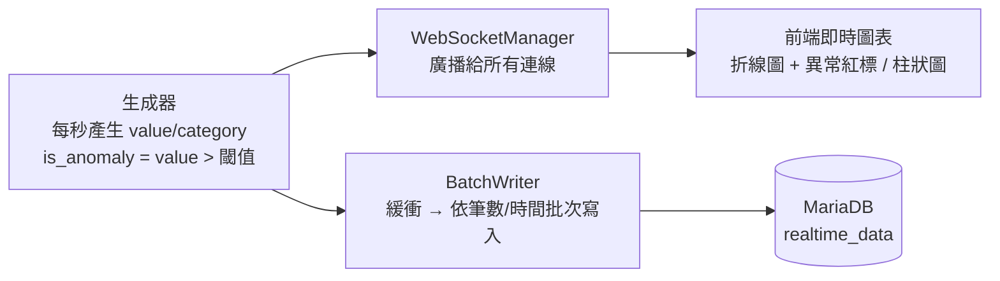
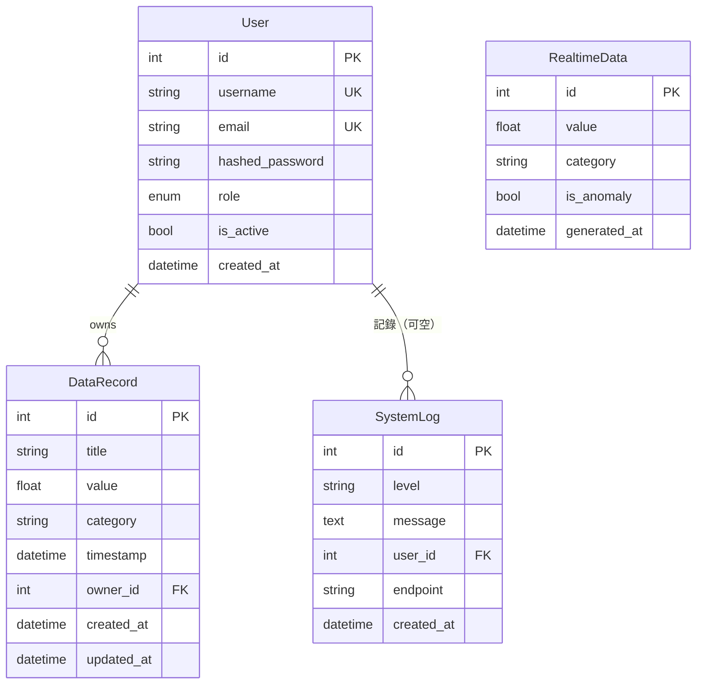

# 系統架構圖

## 容器與資料流

```mermaid
flowchart TB
    subgraph Docker["Docker Compose 網路"]
        FE["Streamlit 前端<br/>(8501)<br/>多頁面 / Session"]
        BE["FastAPI 後端 (8000)<br/>REST + WebSocket + JWT<br/>SQLAlchemy async ORM"]
        DB[("MariaDB 11.7<br/>(3306)<br/>+ Volume db_data")]
        GEN["背景任務<br/>生成器（每秒）/ 批次寫入 / 保留清理"]
    end

    FE -- "HTTP/REST（Bearer JWT）" --> BE
    BE -- "WebSocket 推送" --> FE
    BE -- "asyncmy（連接池）" --> DB
    GEN -- "WebSocket 廣播" --> FE
    GEN -- "批次寫入" --> DB
    BE -.-> GEN
```

## 請求授權流程

```mermaid
sequenceDiagram
    participant U as 使用者（Streamlit）
    participant A as FastAPI
    participant D as MariaDB

    U->>A: POST /api/auth/login（帳號密碼）
    A->>D: 查詢使用者（ORM）
    A->>A: 驗證密碼（bcrypt）、簽發 JWT（60 分鐘）
    A-->>U: access_token + role
    U->>A: 後續請求帶 Authorization: Bearer <token>
    A->>A: 解碼 JWT、檢查角色（RBAC）
    A->>D: ORM 查詢／寫入
    A-->>U: 結果（權限不足回 403，過期回 401）
```

## 即時資料流程

```mermaid
flowchart LR
    G["生成器<br/>每秒產生 value/category<br/>is_anomaly = value > 閾值"]
    WS["WebSocketManager<br/>廣播給所有連線"]
    BW["BatchWriter<br/>緩衝 → 依筆數/時間批次寫入"]
    FE["前端即時圖表<br/>折線圖 + 異常紅標 / 柱狀圖"]
    DB[("MariaDB<br/>realtime_data")]

    G --> WS --> FE
    G --> BW --> DB
```

## 資料模型關聯

```mermaid
erDiagram
    User ||--o{ DataRecord : owns
    User ||--o{ SystemLog : "記錄（可空）"
    RealtimeData

    User {
        int id PK
        string username UK
        string email UK
        string hashed_password
        enum role
        bool is_active
        datetime created_at
    }
    DataRecord {
        int id PK
        string title
        float value
        string category
        datetime timestamp
        int owner_id FK
        datetime created_at
        datetime updated_at
    }
    RealtimeData {
        int id PK
        float value
        string category
        bool is_anomaly
        datetime generated_at
    }
    SystemLog {
        int id PK
        string level
        text message
        int user_id FK
        string endpoint
        datetime created_at
    }
```

> 註：本架構圖以 Mermaid 文字格式維護，可於 GitHub 直接渲染。若需 PNG，可用 mermaid-cli（`mmdc`）或線上編輯器匯出。
